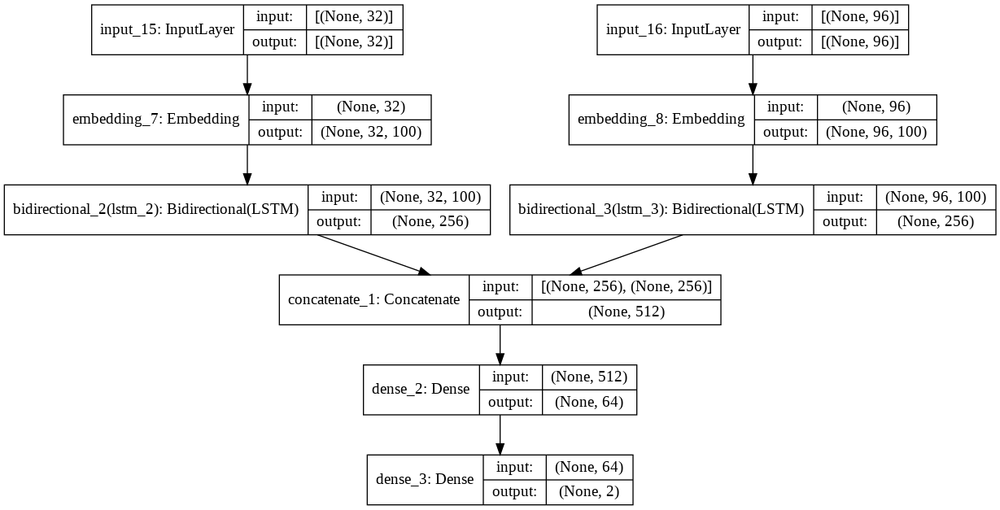

# Update!
Hi, Thanks for reading the report. Although the deadline has passed I wanted to try improving my model and implement new things. Therefore I wanted to create a release just before the deadline for the challenge. So if you would like to see that version of the repo, [here it is.](https://github.com/Hsgngr/dcipher-nlp-challenge/releases/tag/Deadline_version) 

Otherwise this is the updated and latest version of the report.

# Introduction
This report outlines my approach to the dcipher-nlp-challenge's Binary Classifier for academic articles. The goal of the project was to correctly classify academic article's label as
"Chemistry" or "Material Science". We are given 7494 article with their titles and abstracts. As we are using text as our input data, the project falls under the category of Text Classification.

The main challenges of the project are three-fold:

 * There are two different inputs,'Title' and 'Abstract'. Title is short enough to iterate the model on it however abstract has many valuable information about the article's label. It was challenging to select between two and hard to combine.
 * Since these are academic articles, many of them had unique words which are not part of the pre-trained embedding models such as GLOVE.
 * Chemistry and Material Science are not that much different from each other. Material Science is a multi-diciplinary field which is correlated with Chemistry a lot. Therefore it was another challenge to classify them correctly.

The next sections should give an insight into how I have adressed these challenges.

# Approach

### Preprocessing
As the project required I split my dataset into training and test sets by stratifying the Label column of the data. I saved them in the data folder.

```              
                       TRAIN       TEST
Material Science:      3033        759
Chemistry:             2962        740
```
I looked into text data and plot the number of each words in titles and abstracts.
Word Counts in Title          |  Word Counts in Abstract
:-------------------------:|:-------------------------:
  |  

For preprocessing I created my text corpus by using several different techniques including:

- Converting to lower case
- Removing en_stop words and custom words such as 'Elsevier' or 'biorxic' which doesn't help to the model at all.
- Removing all single characters
- Substituting multiple spaces with single space
- Lemmatization

The maximum length of a sentence is 36 and the maximum length of an abstract is 630. if we want to concetenate them having unbalance can be a problem. For starting the project I decided to go with only Titles.

### First Trials
To adress the projects's complexity, I started with an MVP where I was only using a small dataset of GLOVE embeddings (6B and 50d). As preprocessing, I split the sentences into word lists convert them to lower case and remove all punctuations. When I saw some words like 'self-assembly', I understood that it was a mistake to delete '-' and some others so I customized the punctuations that I'm removing. I have found there were 14433 unique words just in Title and when I used Glove Embeddings, 7194 of them didn't have an embedding in the GLOVE model. So I was curious whether if I used really small dataset of GLOVE or these words or not common enough to be in the vocabularies of these models. I decided to use one of the GLOVE's bigger dataset which includes 840B words with 300 columns) and still got 5781 unknown words I embedded unknown words as 'unk' and you can see how many times did they used in titles. 

```   
                                 GLOVE_6B.50d       GLOVE_840B.300d
Total unique words:              14433              14433      
Total unknown words:             7194               5781
Total count of <unk> token:      12994              7365
```

As the most naive approach I took the average vector of each Title by adding each words together and dividing them by the counter of the word. Although this wasn't a huge success (62 % accuracy) it helped me to create my pipeline around the project. Since nearly half of the embeddings were unknown I decided to create my own embeddings from the scratch with TensorFlow. By creating an embedding model from scratch maximum vocabulary number defined as `1000`  and maximum word count as`36`. This approach also got only 64% accuracy.

From there I have decided to try Google's BERT model which has many options and easier to implement with TensorFlow. I started with Small-bert (great for experimenting with the data and iteration of the process) and I set up my model around it. However it wasn't more successful from the other trials. Then I tried to use only abstract and then combination of abstract and title by just concatinating them.

### Main Approach
For my last resort, I decided to implement FastText since it can create embeddings for every word even ones which are not included in vocabulary by using . I used FastText huge pre-trained model and got 65 % accuracy. I thought this approach can be promising. I decided to use the all words in the training set to create a vocabulary for my task. However since there were only 7494 articles I decided to add external sources to my vocabulary. For that I used wikipedia pages.

By using wikipedia's own API I added 3 page to my text corpus for the fastText model. 'Chemistry', 'Chemical element', and 'Material Science'.
This approach increased my vocabulary to 15421 words.

After some hyperparameter tuning I decided to go with these parameters for my fastText model:
```
embedding_size = 100
window_size = 40
min_word = 5
down_sampling = 1e-2
```
After creating my embedding layer, I tried to find the best way to combine title and abstract features.
I concatenate them into one feature by adding a special <sep> token between them however it didn't improve the model. their size were different and after cleaning both of them maximum title length was 36 and maximum abstract length was 97.
It didn't increase my accuracy. I decided to feed my deep learning model with multiple inputs rather than just one concatenated one. I created an input layer for titles which has maximum length of 32 and another input layer for abstracts which has maximum length of 96. Together they are summing up to 128. By using the same embedding layer but giving the columns seperately I achieved 71.6 % accuracy which I was aiming as a milestone.
 
The model's summary:
```   
Model: "Bidirectional LSTM Model with Multiple Inputs"
__________________________________________________________________________________________________
Layer (type)                    Output Shape         Param #     Connected to                     
==================================================================================================
input_71 (InputLayer)           [(None, 32)]         0                                            
__________________________________________________________________________________________________
input_72 (InputLayer)           [(None, 96)]         0                                            
__________________________________________________________________________________________________
embedding_69 (Embedding)        (None, 32, 100)      1542100     input_71[0][0]                   
__________________________________________________________________________________________________
embedding_70 (Embedding)        (None, 96, 100)      1542100     input_72[0][0]                   
__________________________________________________________________________________________________
bidirectional_23 (Bidirectional (None, 256)          234496      embedding_69[0][0]               
__________________________________________________________________________________________________
bidirectional_24 (Bidirectional (None, 256)          234496      embedding_70[0][0]               
__________________________________________________________________________________________________
concatenate_18 (Concatenate)    (None, 512)          0           bidirectional_23[0][0]           
                                                                 bidirectional_24[0][0]           
__________________________________________________________________________________________________
dense_66 (Dense)                (None, 64)           32832       concatenate_18[0][0]             
__________________________________________________________________________________________________
dense_67 (Dense)                (None, 2)            130         dense_66[0][0]                   
==================================================================================================
Total params: 3,586,154
Trainable params: 501,954
Non-trainable params: 3,084,200
```
The visualization of the model:
 

# Results and Discussion

With a a relatively small dataset of GLOVE (smallest 6B) and with 2 LSTM layers the model is trained.

Accuracy Plot              |  Loss Plot
:-------------------------:|:-------------------------:
  |  

It was prone to overfitting therefore I didnt run with more epochs.

# Conclusion
Althought the project wasn't successful, I learned many new things about NLP and state-of-art technologies of Embedding. The models that I tried in this project are GLOVE, BERT and FastText in this order.The model achieved 67% accuracy in the test data with only Titles.

As a future work, I will try to create my model with the FastText embeddings and boosting my vocabulary with Abstracts and external sources like wikipedia and academic articles. I believe FastText will increase the model's accuracy by using its ability to create word representations for even made-up words.


