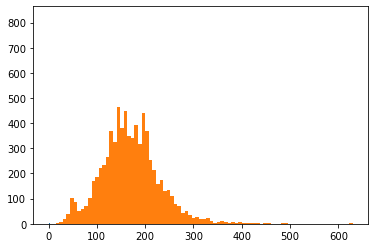

# Update
Hi, Thanks for reading the report. Although the deadline has passed I wanted to try improving my model and implement new things. Therefore I wanted to create a release just before the deadline for the challenge. So if you would like to see that version of the repo, [here it is](https://github.com/Hsgngr/dcipher-nlp-challenge/releases/tag/Deadline_version) Otherwise this is the updated and latest version of the report.

# Introduction
This report outlines my approach to the dcipher-nlp-challenge's Binary Classifier for academic articles. The goal of the project was to correctly classify academic article's label as
"Chemistry" or "Material Science". We are given 7494 article with their titles and abstracts. As we are using text as our input data, the project falls under the category of Text Classification.

The main challenges of the project are three-fold:

 * There are two different inputs,'Title' and 'Abstract'. Title is short enough to iterate the model on it however abstract has many valuable information about the article's label. It was challenging to select between two and hard to combine.
 * Since these are academic articles, many of them had unique words which are not part of the pre-trained embedding models such as GLOVE.
 * Chemistry and Material Science are not that much different from each other. Material Science is a multi-diciplinary field which is correlated with Chemistry a lot. Therefore it was another challenge to classify them correctly.

The next sections should give an insight into how I have adressed these challenges.

# Approach

As the project required I split my dataset into training and test sets by stratifying the Label column of the data. I saved them in data folder.

```              
                       TRAIN       TEST
Material Science:      3033        759
Chemistry:             2962        740
```
I looked into text data and plot the number of each words in titles and abstracts.
Word Counts in Title          |  Word Counts in Abstract
:-------------------------:|:-------------------------:
  |  

The maximum length of a sentence is 36 and the maximum length of an abstract is 630. This may create a problem if we want to concetenate them since the numbers are not close to each other. For starting the project I decided to go with only Titles.

To adress the projects's complexity, I started with an MVP where I was only using a small dataset of GLOVE embeddings (6B and 50d). As preprocessing, I split the sentences into word lists convert them to lower case and remove all punctuations from the Titles. When I saw some words like 'self-assembly', I understood that it was a mistake to delete '-' and some others so I customized the punctuations that I'm removing. I have found there were 14433 unique words just in Title and when I used Glove Embeddings, 7194 of them didn't have an embedding in the GLOVE model. So I was curious whether if I used really small dataset of GLOVE or these words or not common enough to be in the vocabularies of these models. I decided to use one of the GLOVE's bigger dataset which includes 840B words with 300 columns) and still got 5781 unknown words I embedded unknown words as 'unk' and you can see how many times did they used in titles. 

```   
                                 GLOVE_6B.50d       GLOVE_840B.300d
Total unique words:              14433              14433      
Total unknown words:             7194               5781
Total count of <unk> token:      12994              7365
```

As the most naive approach I took the average vector of each sentences by adding each words together and dividing them by the counter of the word. Although this wasn't a huge success it helped me to create my pipeline around the project. Since nearly half of the embeddings were unknown I decided to create my own embeddings from the scratch with TensorFlow. By creating an embedding model from scratch maximum vocabulary number defined as `1000`  and maximum word count as`36`. This approach also got only %65 accuracy.

From there I have decided to try Google's BERT model which has many options and easier to implement with TensorFlow. I started with Small-bert which is great for experimenting with the data and iteration of the process. I set up my model and train it. However it wasn't more successful from the other trials. Then I tried to use only abstract and then combination of abstract and title.

For my last resort, I tried the FastText model and I have found that It could have been a great model only If I could find a way to use since it is a great model for unknown words. I trained the FastText model for 3 hours and accidentally removed it with one click.

Therefore I am submitting my first approach with the GLOVE embeddings and custom text vectorization.

The model's summary is
```   
Model: "model_3"
_________________________________________________________________
Layer (type)                 Output Shape              Param #   
=================================================================
input_4 (InputLayer)         [(None, 36)]              0         
_________________________________________________________________
embedding_4 (Embedding)      (None, 36, 50)            20000050  
_________________________________________________________________
lstm_6 (LSTM)                (None, 36, 128)           91648     
_________________________________________________________________
dropout_6 (Dropout)          (None, 36, 128)           0         
_________________________________________________________________
lstm_7 (LSTM)                (None, 128)               131584    
_________________________________________________________________
dropout_7 (Dropout)          (None, 128)               0         
_________________________________________________________________
dense_3 (Dense)              (None, 2)                 258       
_________________________________________________________________
activation_3 (Activation)    (None, 2)                 0         
=================================================================
Total params: 20,223,540
Trainable params: 223,490
Non-trainable params: 20,000,050
```


# Results and Discussion

With a a relatively small dataset of GLOVE (smallest 6B) and with 2 LSTM layers the model is trained.

Accuracy Plot              |  Loss Plot
:-------------------------:|:-------------------------:
  |  

It was prone to overfitting therefore I didnt run with more epochs.

# Conclusion
Althought the project wasn't successful, I learned many new things about NLP and state-of-art technologies of Embedding. The models that I tried in this project are GLOVE, BERT and FastText in this order.The model achieved 67% accuracy in the test data with only Titles.

As a future work, I will try to create my model with the FastText embeddings and boosting my vocabulary with Abstracts and external sources like wikipedia and academic articles. I believe FastText will increase the model's accuracy by using its ability to create word representations for even made-up words.


